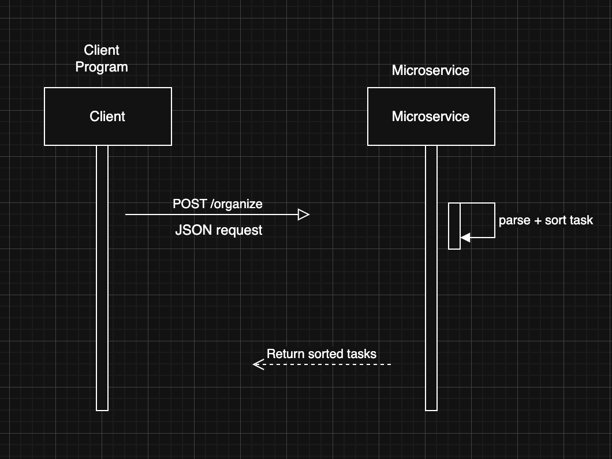

# Microservice A - Task Organizer API

**For:** Adam Danielson  
**Implemented by:** Peter Nikitakis

---

## Overview

This microservice receives a list of tasks and returns them sorted in ascending order by due date. It supports robust validation by skipping tasks with missing or invalid dates. The API follows REST principles and communicates using JSON.

---

## How to Request and Receive Data

Your application must make an HTTP `POST` request to the following endpoint:

**POST** `http://localhost:6000/organize`

---

### Request Format:

- **Content-Type:** `application/json`
- **Body:**

```json
{
  "tasks": [
    { "task_name": "Do laundry", "due_date": "2025-08-04" },
    { "task_name": "Buy groceries", "due_date": "2025-08-03" }
  ]
}


